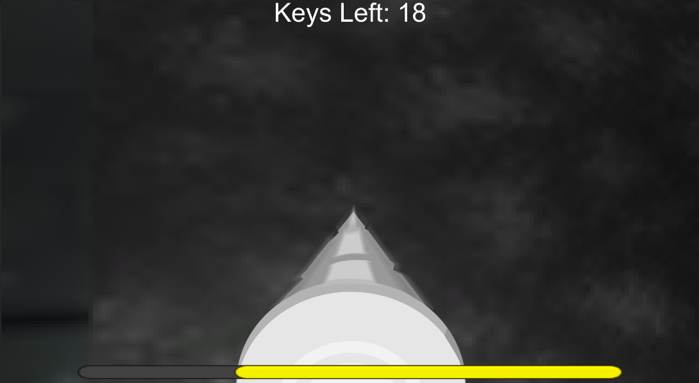

# Lost Dog - Entry for GDA Halloween Jam 2021
Vector art by Jerrod Burns, everything else by Xander.

The "Spook Game" folder contains the unity project for the game.
It consists of a randomly generated cavern maze that the player must go through finding keys, drilling through walls if necessary. However, something large and vicious lurks in the darkness.

The original game code was made in the span of 3 (very busy college student) weeks. 
There have been several bug fixes and enhancements made since the game was initially released.

[itch.io page](https://x54321.itch.io/lost-dog)

Controls: WASD for movement, Q and A or mouse for turning. Hold space or left mouse to drill through rocky walls.

 

No ownership is claimed on the sound effects. All other assets (textures, models, sprites, etc.) are licensed under Creative Commons Attribution (https://creativecommons.org/licenses/by/3.0/). The game code and other files are licensed under GPL3 (detailed in the LICENSE file).
