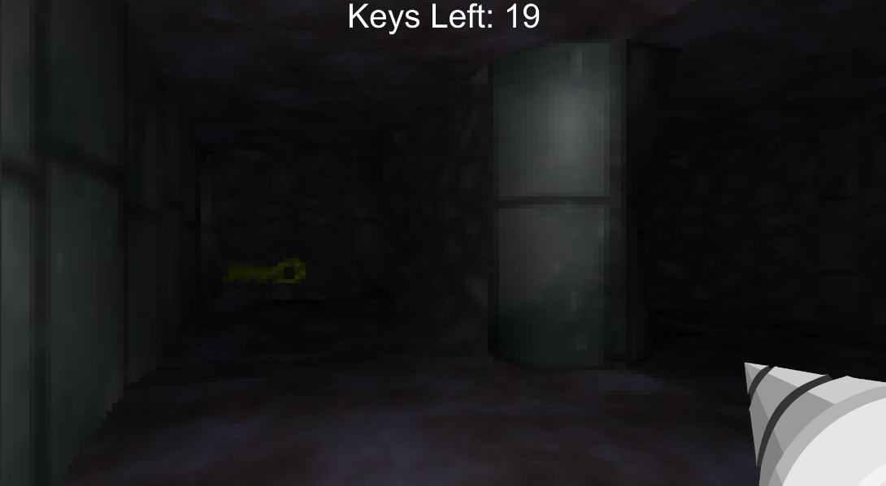

# Lost Dog - Entry for GDA Halloween Jam 2021
Vector art by Jerrod, everything else by Xander.

The "Spook Game" folder contains the unity project for the game.
This is, for the most part, the final state of the game submitted to the jam, but with some small improvements to the HUD and attempted bug fixes. This game
may be improved upon at some later date, but also may not.

This code was made in the span of 3 (very busy college student) weeks and is very sloppy and undocumented. If there are *specific* questions about this code, contact TheTophatDemon on Discord.

[itch.io page](https://x54321.itch.io/lost-dog)

No ownership is claimed on the sound effects. All other assets (textures, models, sprites, etc.) are licensed under Creative Commons Attribution (https://creativecommons.org/licenses/by/3.0/). The game code and other files are licensed under GPL3 (detailed in the LICENSE file).
